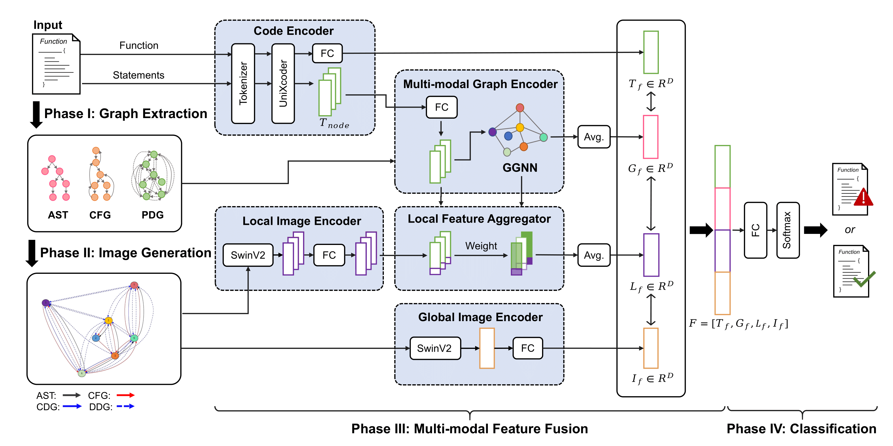

# Abundant Modalities Offer More Nutrients: Multi-Modal Based Function-level Vulnerability Detection

Software vulnerabilities are the weaknesses in software systems, that leads to serious cybersecurity problems. Recently, many deep learning-based approaches have been proposed to detect vulnerabilities at the function level by using one or a few different modalities (e.g., text representation, graph-based representation) of the function and have achieved promising performance. However, some of these existing studies have not completely leveraged these diverse modalities, particularly the underutilized image modality, and the others using images to represent functions for vulnerability detection have not made adequate use of the significant graph structure underlying the images. 

In this paper, we propose MVulD+, a multi-modal-based function-level vulnerability detection approach, which utilizes multi-modal features of the function (i.e., text representation, graph representation, and image representation) to detect vulnerabilities. Specifically, MVulD+ utilizes a pre- trained model (i.e., UniXcoder) to learn the semantic information of the textual source code, employs the graph neural network to distill graph-based representation, and makes use of computer vision techniques to obtain the image representation while retaining the graph structure of the function. To investigate the effectiveness of MVulD+, we conduct a large-scale experiment (25,816 functions) by comparing it with eight state-of-the-art baselines. Experimental results demonstrate that MVulD+ improves the state-of-the-art baselines by 24.3%- 125.7%, 5.2%-31.4%, 40.6%-192.2%, and 22.3%-186.9% in terms of F1-score, Accuracy, Precision, and PR-AUC respectively.

# Overview of MVulD+


<p align="center"> An overview architecture of MVulD+ </p> 

MVulD+ consists of four four main phases:

1.Graph Extraction: obtain the structure representation of the function. 

2.Image generation: helps to transform the structural graph into graphical representation.

3.Multi-modal feature fusion: builds the relationship of various modalities to obtain enriched code representations.

4.Classification: applied to detect whether a function is vulnerable or not. 

# Dataset

In our experiment, we choose the Big-Vul dataset provided by Fan, which is one of the largest vulnerability datasets collected from 348 open-source GitHub projects spanning 91 different vulnerability types. And we normalize the source code by performing three filtering steps on the Big-Vul dataset.Our final dataset contains 25,816 functions in total, including 4,069 vulnerable
functions and 21,747 non-vulnerable functions.
you can download the Big-Vul dataset and process it, or you can also download the preprocessed dataset from [HERE](https://drive.google.com/file/d/16tm5TU9CUCePFg6wJh2kz71SZylKv8zw/view?usp=sharing) and unzip it.

# Source Code

## Conda environment
Create Conda environment

    $ conda env create -f environment.yml

Activate the environment

    $ source activate mvuld+

## Dataset process

We provide dataset processing scripts (including Graph Extraction and Image generation), please refer to `utils/README.md` 


## MVulD+:

To train and test MVulD model, using the following commands. 

```shell
sh train.sh
sh test.sh
```